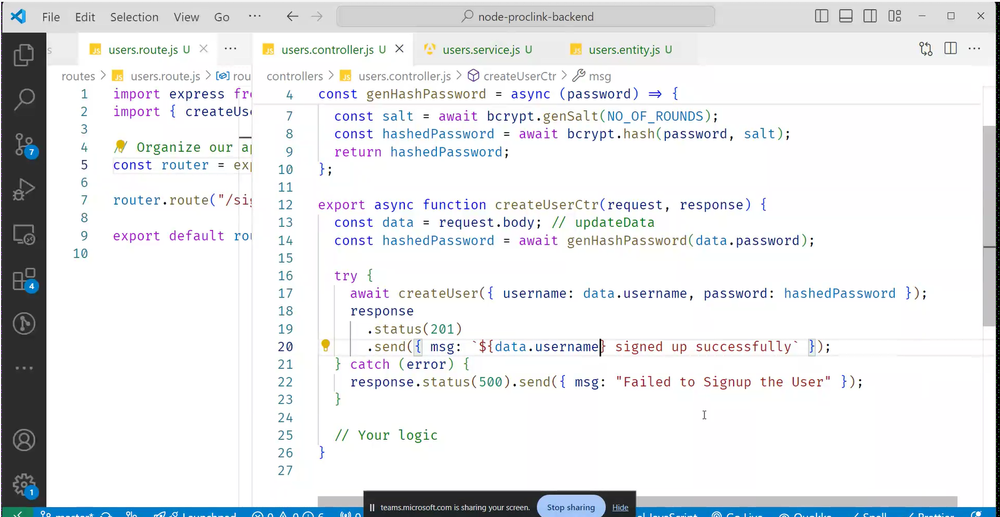
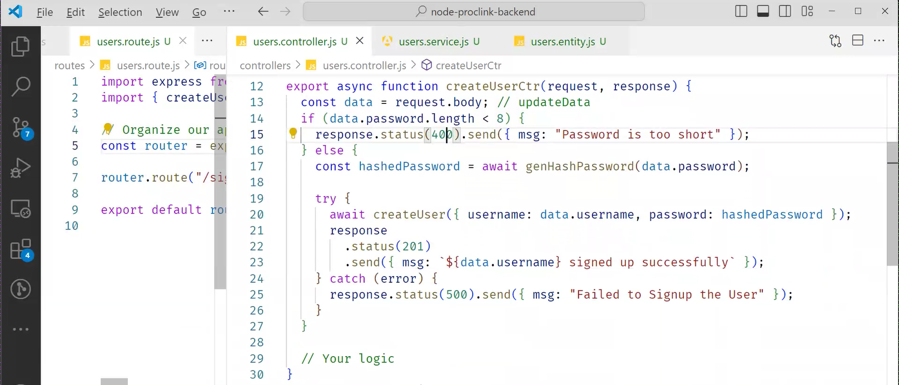
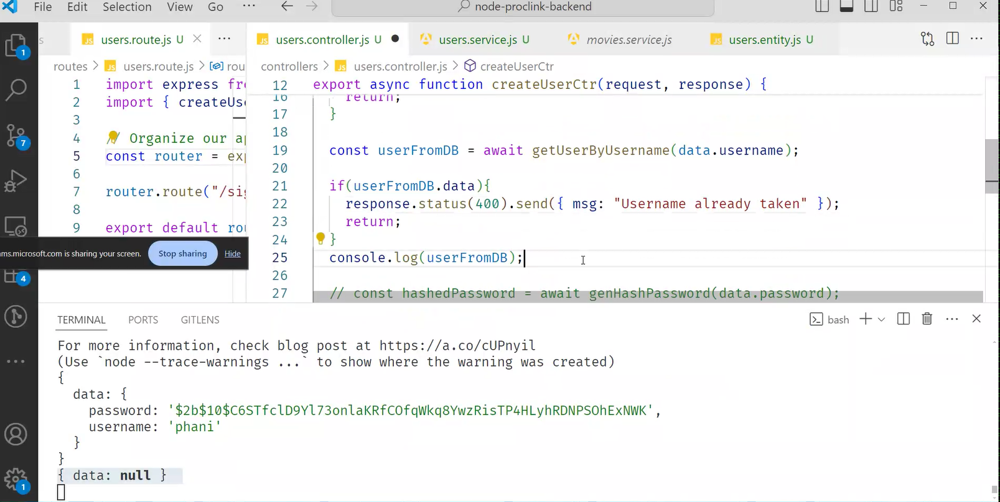
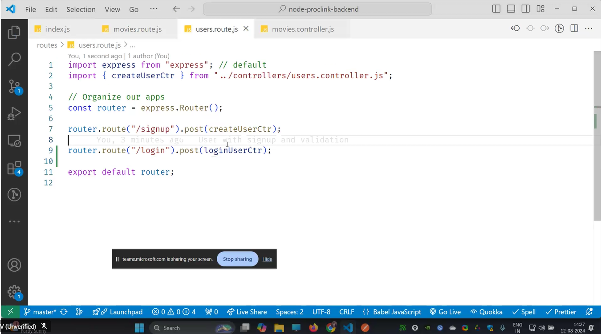
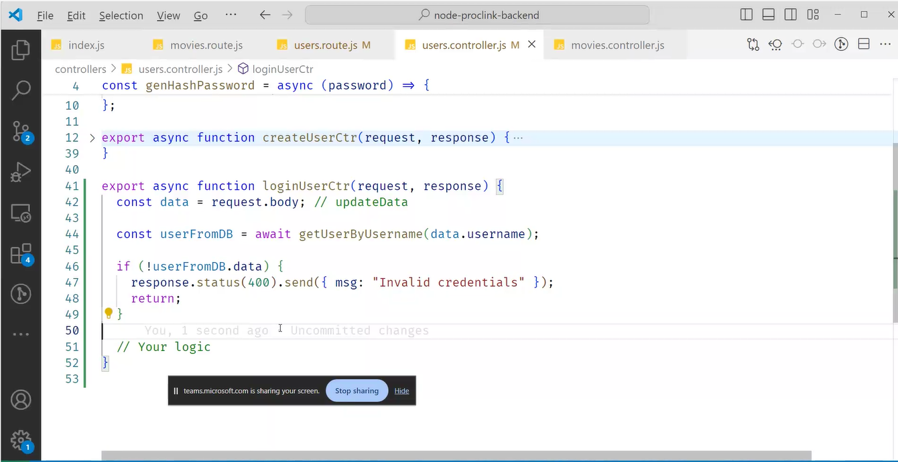
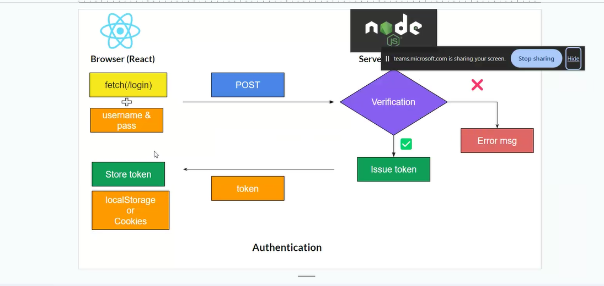
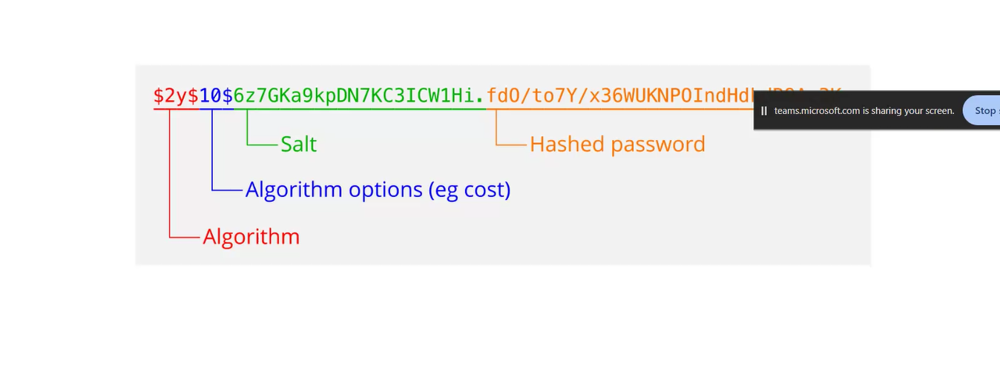
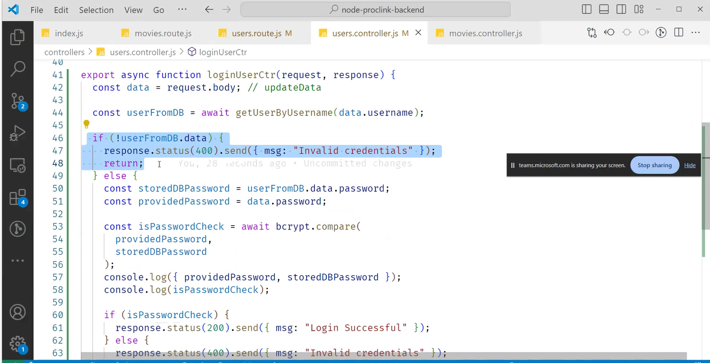
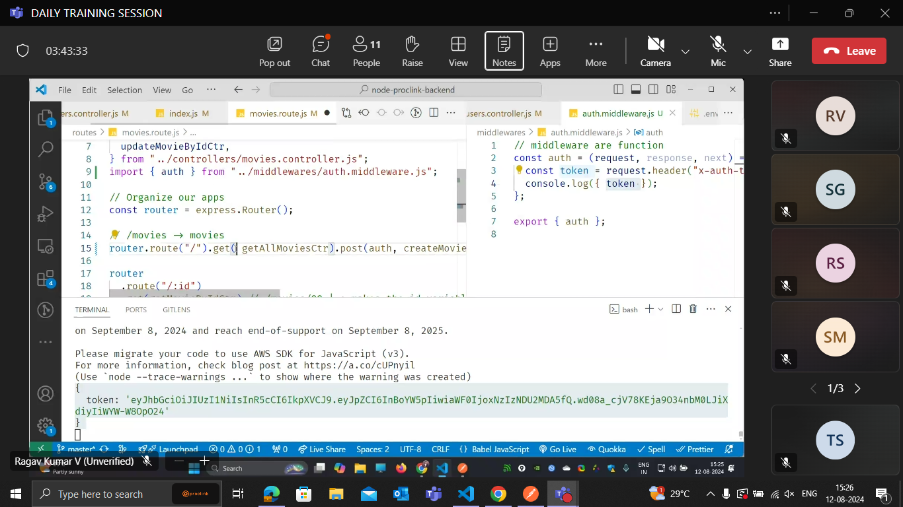
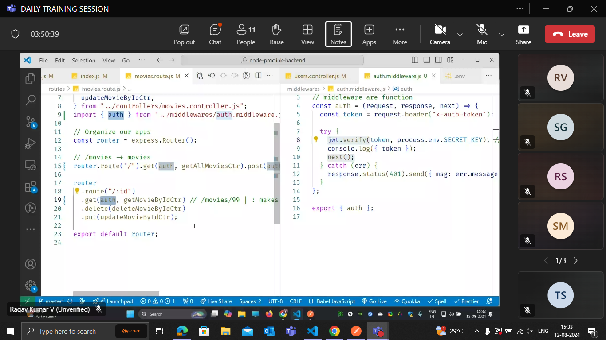

how mangodb works:
database will have
tables==collevtions will have
documents=objects

advantages:
joins nit required.
why?
we dont nead to normalise.,so requirement of joins.
we cannot have row inside row in sql, but here we can have it.
we can have array of documents.

# schema:

1. different key
   . each document can have diff names.
2. extra key
3. consistent
   3 whenever we are unsure of what we get, we can use these mangodb.

# BSON FORMAT

json format will take more space, since the data is repeated.

so it will convert into bson formart
api --->for every adapter is called sdk
python has one js has one
aws can write in py or js

aws------->sdk------> electron db (easy)orms
------js
mongo db --------->sdk-----> mongoose

pk,sk ----> helps for indexing both together.
by default in sql what is order --> primary key
but in dynamo db we have 2 keys pk (primary key)and sk(some other key can be used for sorting purpose)
pk+sk----> primary key
sk-->any column(key)
entitity is schema ( optional but good practice to keep )
attributes are keys - cloumn names

two types to retrive the data

- query--->good--- if indexed then use query if not use scan
- scan --->bad(table scanning)---
  so this is reason we have multiple indexes

  gsi- globals secondary index (non clustered index 1)
  when i do index i need to do pk and sk

  # movies creating table in dynamo db

  - create test.js file-->npm i aws-sdk electrondb

  1. install as a dependency in your project
     > npm install electrodb --save

# embedded documents:

nested documents.

primary key :partition key +sort key

there are three data types:

1. scaler
2. document
3. set

# scaler:

string,
number,
boolean,
any(we dont use it)

# document:

1. list --->[Array]
2. Map

# Set

1. set of strings
2. set of numbers
   these wont allow the duplicate numbers.

these all will take place in backend.

request--->Index--->roouter---->controller--->service--->ineteracts with the database.

# authentication and authorisation:

fetch(login)
----->
verification--->if fail
(error message)
not fail then
---->issue token---->
token (store token)(local storage or cookies)
why local storage?
even though we close the whole system,the login credentails will be there thats why local storage.

authorisation:

how to store password:

1. vulunerable to hacker

there is problem with encrpytion, :
so we are using hashing:
no matter how big the input is, :
the 10 digit number is given.
these numbers are highly sensitive and unique.

real world applications in hashing:
bsnl connecting india(120kb/s)  
windows(4gb)

# salting:

adding value to password and generating a new hash value:
when the user is doing sign up, salting is used,

10 rounds of salting is good, it takes 4seconds only

bcrypt is the pacakge we use.
node.bcrypt.js

do we need validation in the backend?
yes
why?
when hacker directly atacks on backedn
(for security) validation is required for backend
for user experience validation is requied in frontend.

# login:

roles:
super user: can make other persons admin(access+crud)
admin--->can do crud
normal can only read.s
