# node js

what is nodejs?

eniviormnemnt torun js.(place to run js)

why node.js?
some thing broswers cannot do?
crud operations it cannot do.  
it is intentiionally made that way.  
so that others canit change them.

dis advantages :

browers are restricted.

1, cannot acess file systerm  
2.cannot acess hardware details  
3.cannot copy files.  
4. cannot delete files. '

Famous virus are spread through browser.
!. love viruse:
early 20000's 2. worm virus:
it will duplicate

node js is to used to run js, build web apps.

# node js usage:

1. streaming:
2. BDA
3. CHAT BOT
4. web srcapping(stealing data )

# things which wont work on node js:

1. dom methods.

document.getelementbyid, etc wont run.  
2. window object

settimeout,setinterval are present but not in window.(global.this its present)

old module exports:

# os:

(info on cpu, memory, directors,etc)

why backend need this?  
when u run heavy things .

```js
const os = require("os"); //inbuilt package
os.freemem(); //ram
os.titalmem; // total ram
os.version; //version of the os
os.cpus(); //prcoesser
```

# fs(file system)

const fs=require("fs")//imorting

# disk fragmentation:

its all about aranging the books in one place.
hard-disk

# node.js architechture

sunchronous ocode(will be in call stack) will block aysnchrnous code.(call back queue)
when synchrnous code is in call stack, it will block the api

node.js bindings: os operations are present.(os and files are present)  
libuv-->(asynchrnous l/o)(internally its present)(it is abstracted)(it is same like jvm)
(transaltes the api node js porvides converts into os commands,)
node.js developers will use it.

# to create package.json

web architeture:
recstjs--->node express(framework to build server)===>mangodb

sails
koa
meter
happy, these are equilvalet to express.

process to install express:

https://ragavkumarv.com/blog/setup-express/

npm run start
npm run dev
//express is converting the array of objects into json format
// /movies->movies should be displayed

netfligfy cannot connect to local host

app.use(cors());:

express-->converts array of objects into json formart.

```js
//app.use->will apply the middleware to all apis.
//
app.use(cors()); //for all the ,ethods cors is allowed
app.use(express.json());
//for all particular methods, we can keep in betwwen them
```


default value is 4000, this is not valid in local system

push to github


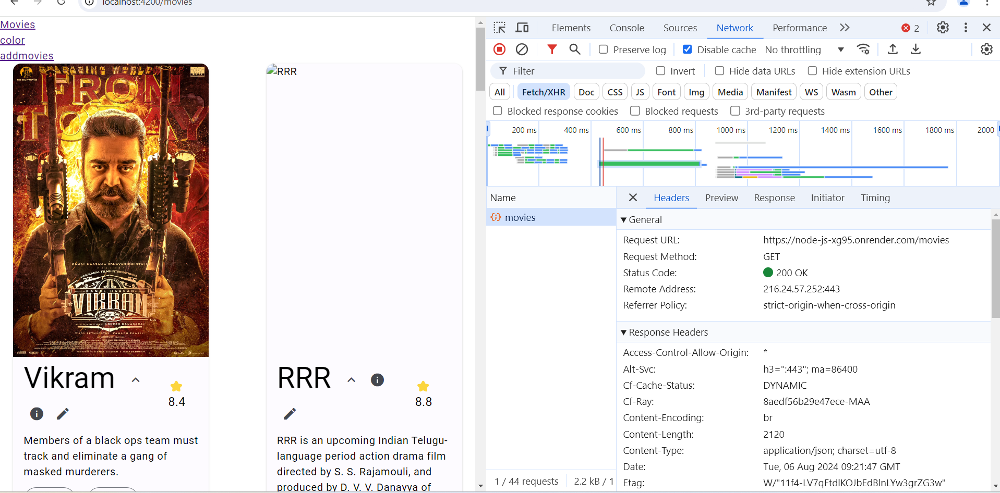
url is taken from render.com
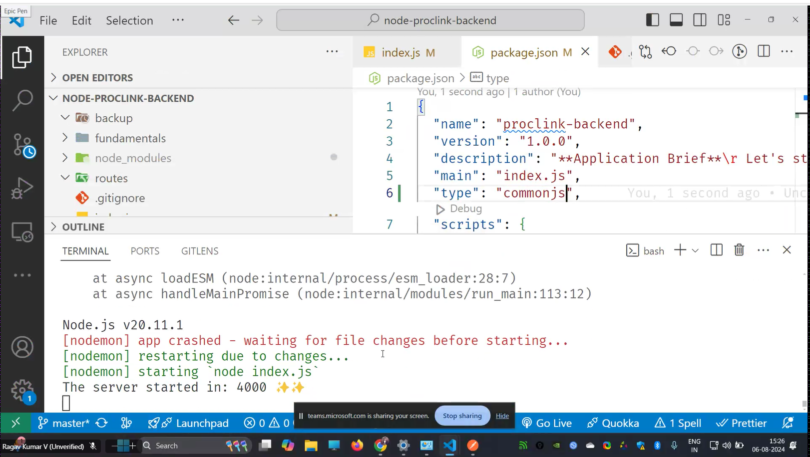
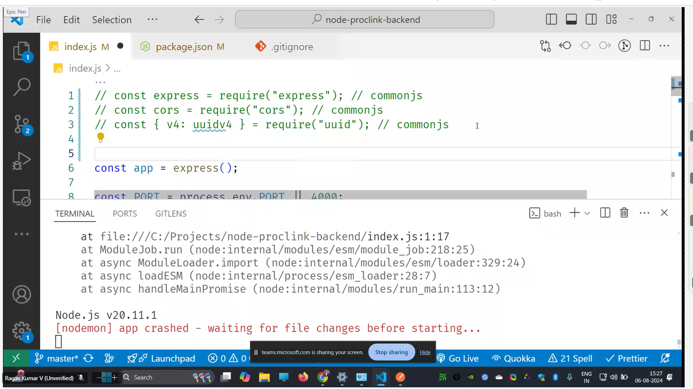
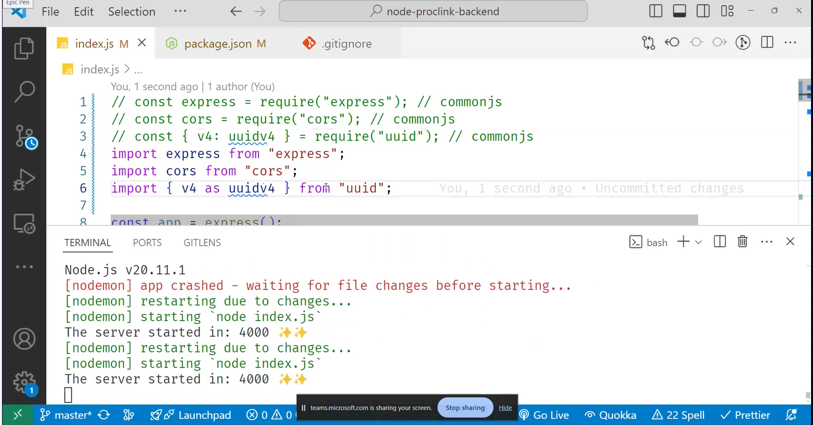
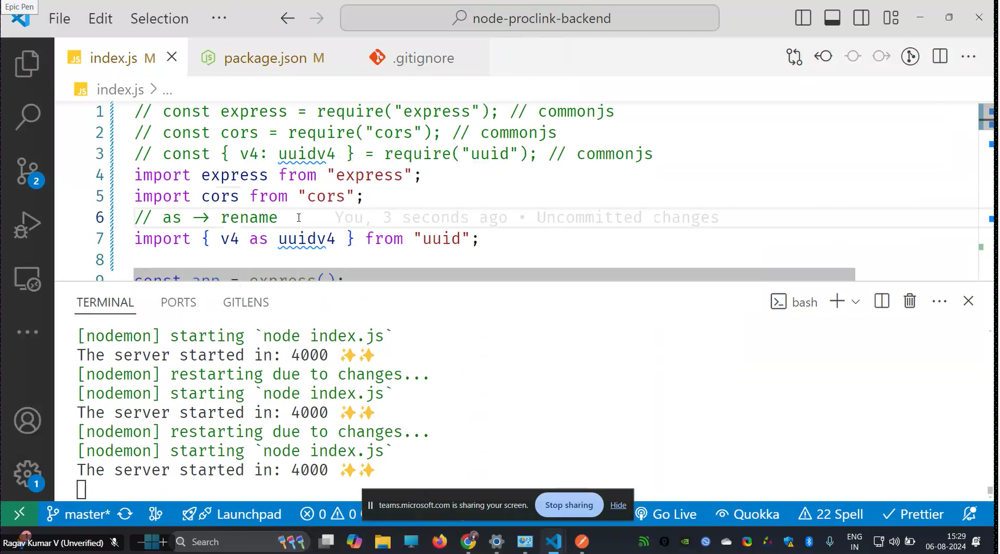
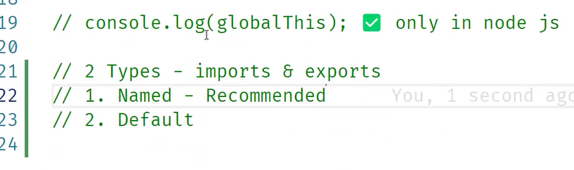
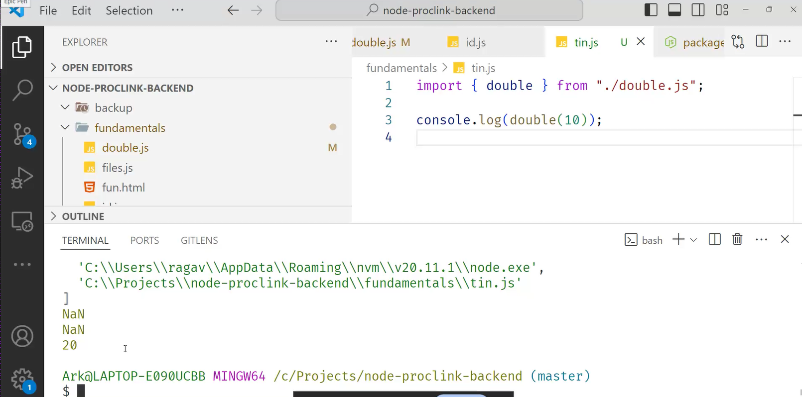
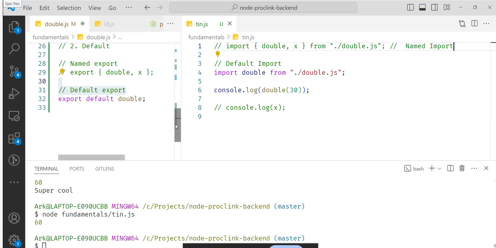
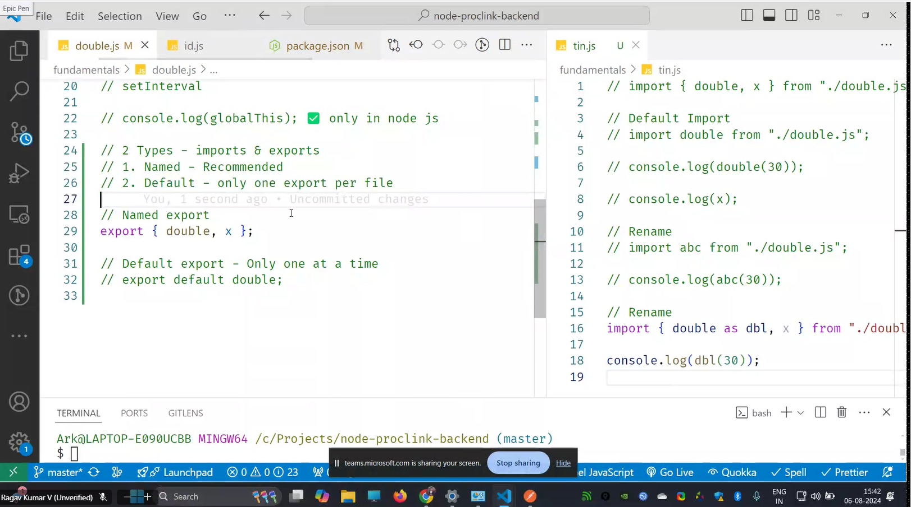
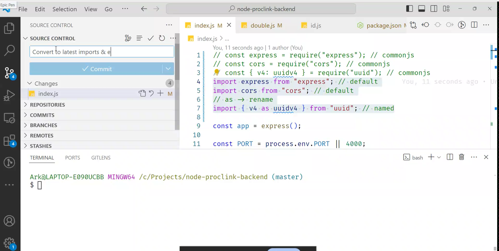
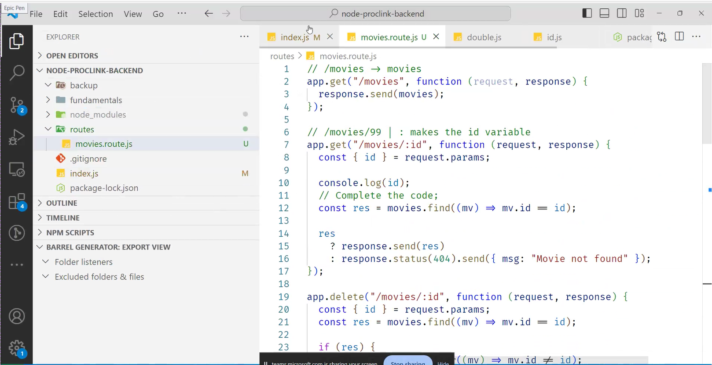
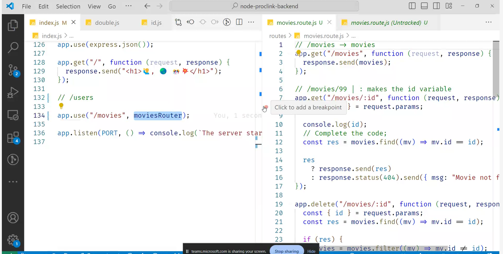
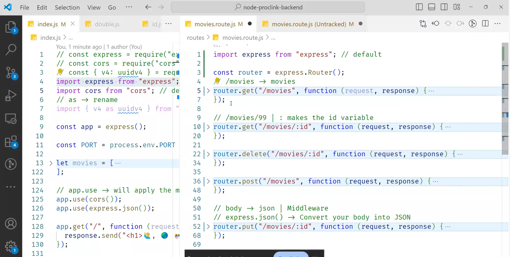
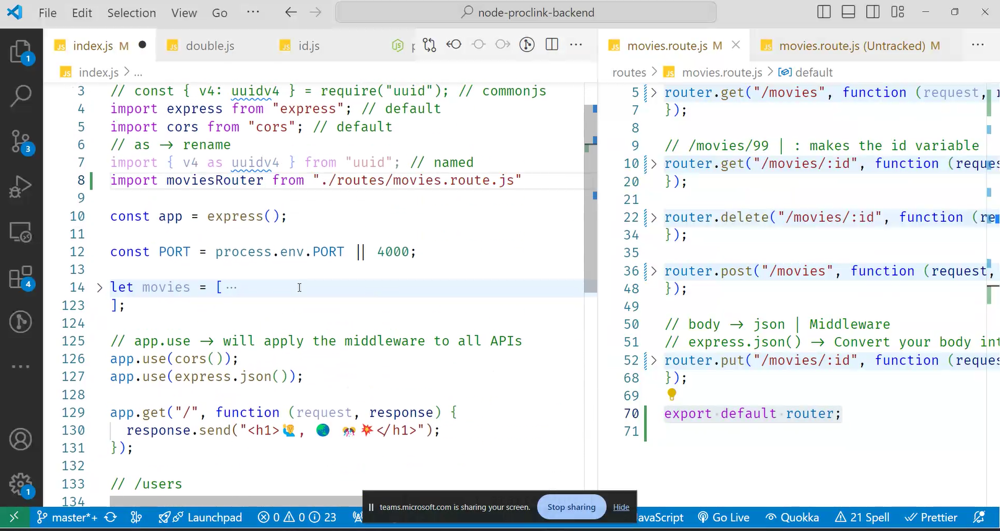
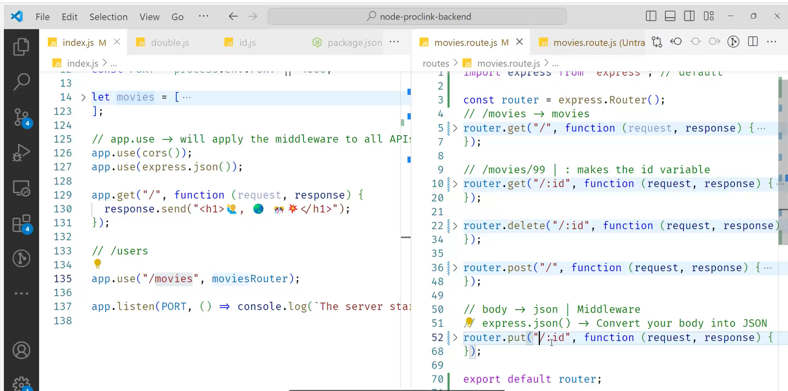
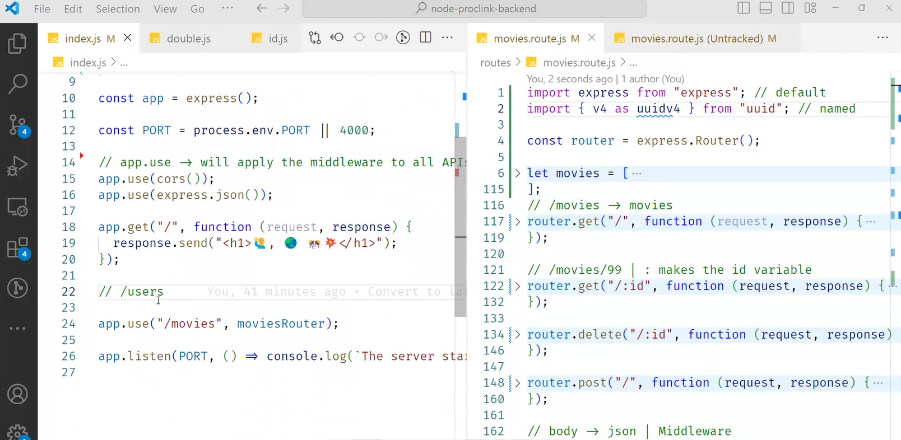
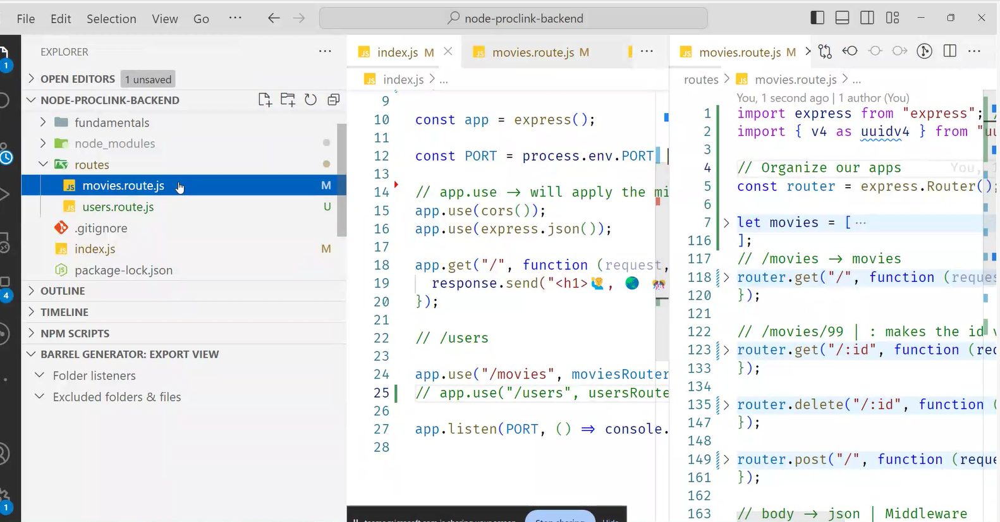

```js
let movies = [
  {
    id: "99",
    name: "Vikram",
    poster:
      "https://m.media-amazon.com/images/M/MV5BMmJhYTYxMGEtNjQ5NS00MWZiLWEwN2ItYjJmMWE2YTU1YWYxXkEyXkFqcGdeQXVyMTEzNzg0Mjkx._V1_.jpg",
    rating: 8.4,
    summary:
      "Members of a black ops team must track and eliminate a gang of masked murderers.",
    trailer: "https://www.youtube.com/embed/OKBMCL-frPU",
  },
  {
    id: "100",
    name: "RRR",
    poster:
      "https://englishtribuneimages.blob.core.windows.net/gallary-content/2021/6/Desk/2021_6$largeimg_977224513.JPG",
    rating: 8.8,
    summary:
      "RRR is an upcoming Indian Telugu-language period action drama film directed by S. S. Rajamouli, and produced by D. V. V. Danayya of DVV Entertainments.",
    trailer: "https://www.youtube.com/embed/f_vbAtFSEc0",
  },
  {
    id: "101",
    name: "Iron man 2",
    poster:
      "https://m.media-amazon.com/images/M/MV5BMTM0MDgwNjMyMl5BMl5BanBnXkFtZTcwNTg3NzAzMw@@._V1_FMjpg_UX1000_.jpg",
    rating: 7,
    summary:
      "With the world now aware that he is Iron Man, billionaire inventor Tony Stark (Robert Downey Jr.) faces pressure from all sides to share his technology with the military. He is reluctant to divulge the secrets of his armored suit, fearing the information will fall into the wrong hands. With Pepper Potts (Gwyneth Paltrow) and Rhodes (Don Cheadle) by his side, Tony must forge new alliances and confront a powerful new enemy.",
    trailer: "https://www.youtube.com/embed/wKtcmiifycU",
  },
  {
    id: "102",
    name: "No Country for Old Men",
    poster:
      "https://upload.wikimedia.org/wikipedia/en/8/8b/No_Country_for_Old_Men_poster.jpg",
    rating: 8.1,
    summary:
      "A hunter's life takes a drastic turn when he discovers two million dollars while strolling through the aftermath of a drug deal. He is then pursued by a psychopathic killer who wants the money.",
    trailer: "https://www.youtube.com/embed/38A__WT3-o0",
  },
  {
    id: "103",
    name: "Jai Bhim",
    poster:
      "https://m.media-amazon.com/images/M/MV5BY2Y5ZWMwZDgtZDQxYy00Mjk0LThhY2YtMmU1MTRmMjVhMjRiXkEyXkFqcGdeQXVyMTI1NDEyNTM5._V1_FMjpg_UX1000_.jpg",
    summary:
      "A tribal woman and a righteous lawyer battle in court to unravel the mystery around the disappearance of her husband, who was picked up the police on a false case",
    rating: 8.8,
    trailer: "https://www.youtube.com/embed/nnXpbTFrqXA",
  },
  {
    id: "104",
    name: "The Avengers",
    rating: 8,
    summary:
      "Marvel's The Avengers (classified under the name Marvel Avengers\n Assemble in the United Kingdom and Ireland), or simply The Avengers, is\n a 2012 American superhero film based on the Marvel Comics superhero team\n of the same name.",
    poster:
      "https://terrigen-cdn-dev.marvel.com/content/prod/1x/avengersendgame_lob_crd_05.jpg",
    trailer: "https://www.youtube.com/embed/eOrNdBpGMv8",
  },
  {
    id: "105",
    name: "Interstellar",
    poster: "https://m.media-amazon.com/images/I/A1JVqNMI7UL._SL1500_.jpg",
    rating: 8.6,
    summary:
      "When Earth becomes uninhabitable in the future, a farmer and ex-NASA\n pilot, Joseph Cooper, is tasked to pilot a spacecraft, along with a team\n of researchers, to find a new planet for humans.",
    trailer: "https://www.youtube.com/embed/zSWdZVtXT7E",
  },
  {
    id: "106",
    name: "Baahubali",
    poster: "https://flxt.tmsimg.com/assets/p11546593_p_v10_af.jpg",
    rating: 8,
    summary:
      "In the kingdom of Mahishmati, Shivudu falls in love with a young warrior woman. While trying to woo her, he learns about the conflict-ridden past of his family and his true legacy.",
    trailer: "https://www.youtube.com/embed/sOEg_YZQsTI",
  },
  {
    id: "107",
    name: "Ratatouille",
    poster:
      "https://resizing.flixster.com/gL_JpWcD7sNHNYSwI1ff069Yyug=/ems.ZW1zLXByZC1hc3NldHMvbW92aWVzLzc4ZmJhZjZiLTEzNWMtNDIwOC1hYzU1LTgwZjE3ZjQzNTdiNy5qcGc=",
    rating: 8,
    summary:
      "Remy, a rat, aspires to become a renowned French chef. However, he fails to realise that people despise rodents and will never enjoy a meal cooked by him.",
    trailer: "https://www.youtube.com/embed/NgsQ8mVkN8w",
  },
  {
    name: "PS2",
    poster:
      "https://m.media-amazon.com/images/M/MV5BYjFjMTQzY2EtZjQ5MC00NGUyLWJiYWMtZDI3MTQ1MGU4OGY2XkEyXkFqcGdeQXVyNDExMjcyMzA@._V1_.jpg",
    summary:
      "Ponniyin Selvan: I is an upcoming Indian Tamil-language epic period action film directed by Mani Ratnam, who co-wrote it with Elango Kumaravel and B. Jeyamohan",
    rating: 8,
    trailer: "https://www.youtube.com/embed/KsH2LA8pCjo",
    id: "108",
  },
  {
    name: "Thor: Ragnarok",
    poster:
      "https://m.media-amazon.com/images/M/MV5BMjMyNDkzMzI1OF5BMl5BanBnXkFtZTgwODcxODg5MjI@._V1_.jpg",
    summary:
      "When Earth becomes uninhabitable in the future, a farmer and ex-NASA\\n pilot, Joseph Cooper, is tasked to pilot a spacecraft, along with a team\\n of researchers, to find a new planet for humans.",
    rating: 8.8,
    trailer: "https://youtu.be/NgsQ8mVkN8w",
    id: "109",
  },
];

///movies to get movies
router.get("/", function (request, response) {
  response.send(movies); //call back funtion we have req and res
});

router.delete("/:id", function (request, response) {
  const { id } = request.params;
  // console.log(id)
  const res = movies.find((m) => m.id == id);
  if (res) {
    movies = movies.filter((m) => m.id != id);
    response.send({ msg: "deleted successfully", data: res });
  } else {
    response.status(404).send({ msg: "Movie not found" });
  }
});

router.post("/", express.json(), function (request, response) {
  const data = request.body;
  console.log(data);
  //   console.log(uuidv4());
  data.id = uuidv4();
  movies.push(data);
  response.send(data);
});

//mix of get and push
router.put(":id", express.json(), function (request, response) {
  const { id } = request.params;
  const data = request.body;

  const movieIdx = movies.findIndex((mv) => mv.id == id);
  if (movieIdx >= 0) {
    movies[movieIdx] = { ...movies[movieIdx], ...data };
    response.send(movies[movieIdx]);
  } else {
    response.status(404).send({ msg: "Movie not found" });
  }
  console.log(id, data, movieIdx);
});

export default router;
```

```

```
