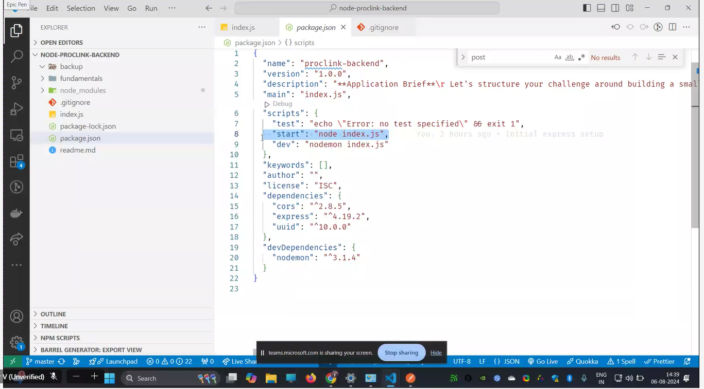
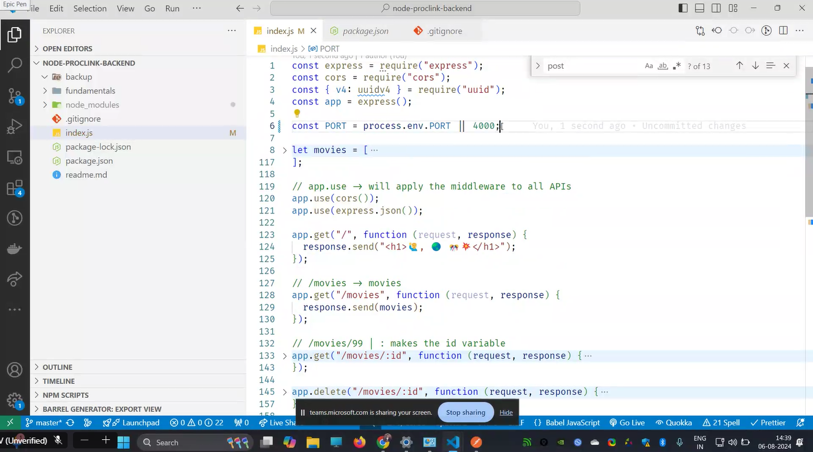
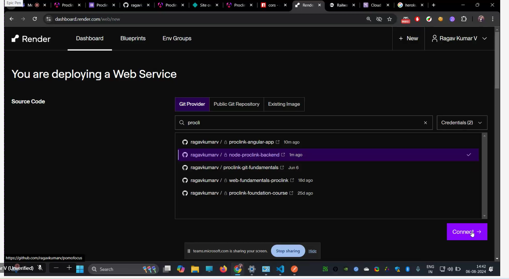
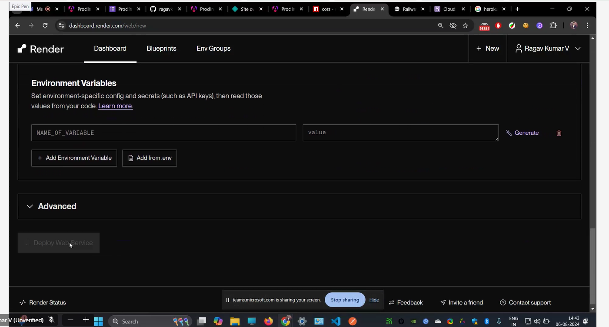

# node js

what is nodejs?

eniviormnemnt torun js.(place to run js)

why node.js?
some thing broswers cannot do?
crud operations it cannot do.  
it is intentiionally made that way.  
so that others canit change them.

dis advantages :

browers are restricted.

1, cannot acess file systerm  
2.cannot acess hardware details  
3.cannot copy files.  
4. cannot delete files. '

Famous virus are spread through browser.
!. love viruse:
early 20000's 2. worm virus:
it will duplicate

node js is to used to run js, build web apps.

# node js usage:

1. streaming:
2. BDA
3. CHAT BOT
4. web srcapping(stealing data )

# things which wont work on node js:

1. dom methods.

document.getelementbyid, etc wont run.  
2. window object

settimeout,setinterval are present but not in window.(global.this its present)

old module exports:

# os:

(info on cpu, memory, directors,etc)

why backend need this?  
when u run heavy things .

```js
const os = require("os"); //inbuilt package
os.freemem(); //ram
os.titalmem; // total ram
os.version; //version of the os
os.cpus(); //prcoesser
```

# fs(file system)

const fs=require("fs")//imorting

# disk fragmentation:

its all about aranging the books in one place.
hard-disk

# node.js architechture

sunchronous ocode(will be in call stack) will block aysnchrnous code.(call back queue)
when synchrnous code is in call stack, it will block the api

node.js bindings: os operations are present.(os and files are present)  
libuv-->(asynchrnous l/o)(internally its present)(it is abstracted)(it is same like jvm)
(transaltes the api node js porvides converts into os commands,)
node.js developers will use it.

# to create package.json

web architeture:
recstjs--->node express(framework to build server)===>mangodb

sails
koa
meter
happy, these are equilvalet to express.

process to install express:

https://ragavkumarv.com/blog/setup-express/

npm run start
npm run dev
//express is converting the array of objects into json format
// /movies->movies should be displayed

netfligfy cannot connect to local host

app.use(cors());:

express-->converts array of objects into json formart.

```js
//app.use->will apply the middleware to all apis.
//
app.use(cors()); //for all the ,ethods cors is allowed
app.use(express.json());
//for all particular methods, we can keep in betwwen them
```


default value is 4000, this is not valid in local system

push to github


